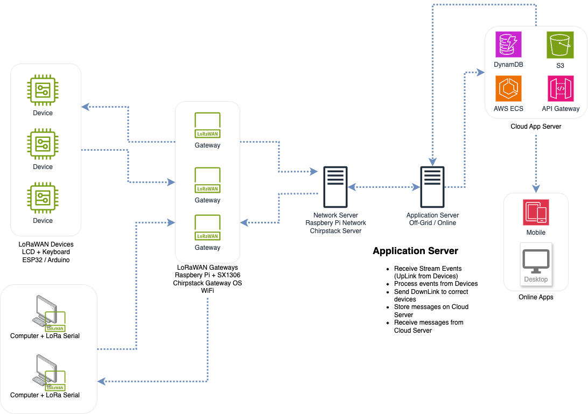

# Chirper - Emergency Message System

## Description
Chirper is an emergency message system that allows users to send messages between devices
connected on the same LoRaWAN network. The system is designed to be used in emergency situations
where the internet is not available, but a LoRaWAN network is present.

## Architecture

The system is composed of small devices that can send and receive messages. The devices are
connected to a LoRaWAN network, which is responsible for routing the messages between the devices.

We also implement our own LoRaWAN network using the [ChirpStack](https://www.chirpstack.io/) open-source
LoRaWAN Network Server. The ChirpStack Network Server is responsible for managing the devices and
routing the messages between them. We also implement a relay server that is responsible for
forwarding the messages to the devices through the ChirpStack Network Server using its API.

Below is the architecture of the system:

## Devices Support

We are currently supporting the following devices:

- [x] Heltec LoRa WiFi 32 (V2)
- [x] LilyGo T-Deck

## Structure

We have two main folders in the project:

- `devices`: Contains the code for the devices supported by the project.
- `application_server`: Contains the code for the relay server that forwards the messages to the devices.

## Status

The project is still in development....